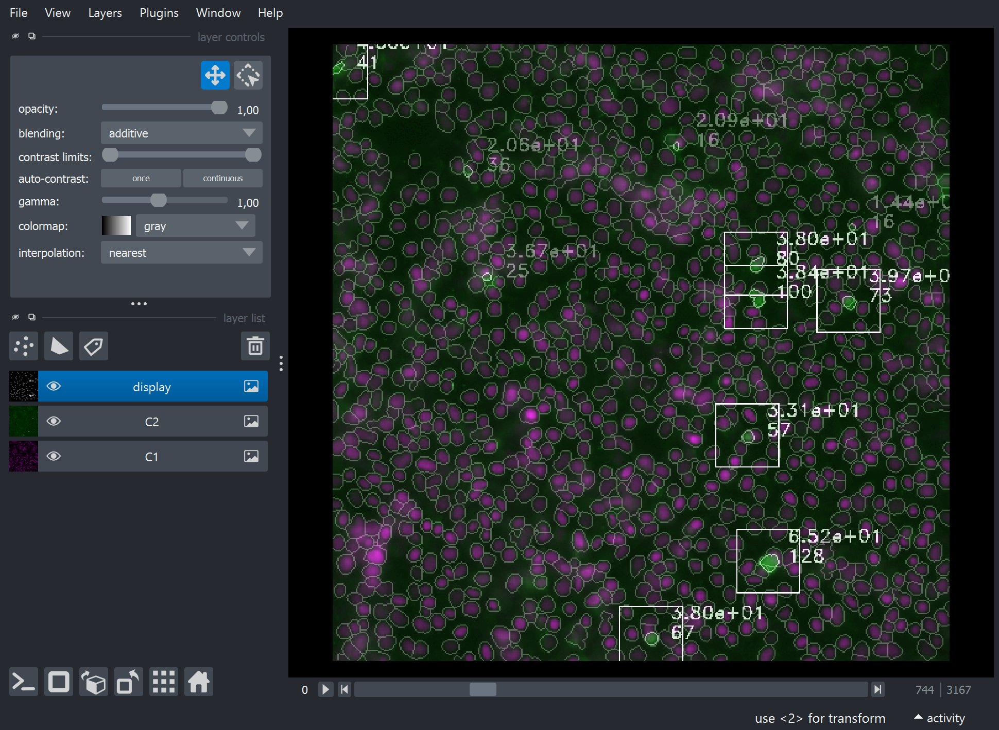

?logo=python&logoColor=rgb(149%2C157%2C165)&labelColor=rgb(50%2C60%2C65))
?logo=TensorFlow&logoColor=rgb(149%2C157%2C165)&labelColor=rgb(50%2C60%2C65))
?logo=NVIDIA&logoColor=rgb(149%2C157%2C165)&labelColor=rgb(50%2C60%2C65))
?logo=NVIDIA&logoColor=rgb(149%2C157%2C165)&labelColor=rgb(50%2C60%2C65))    
&color=rgb(149%2C157%2C165))
&color=rgb(149%2C157%2C165))
&color=rgb(149%2C157%2C165))    

# ETH-ScopeM_Roganowicz  
Nuclei segmentation and fluorescence quantification

## Index
- [Installation](#installation)
- [Usage](#usage)
- [Comments](#comments)

## Installation

Pease select your operating system

<details> <summary>Windows</summary>  

### Step 1: Download this GitHub Repository 
- Click on the green `<> Code` button and download `ZIP` 
- Unzip the downloaded file to a desired location

### Step 2: Install Miniforge (Minimal Conda installer)
- Download and install [Miniforge](https://github.com/conda-forge/miniforge) for your operating system   
- Run the downloaded `.exe` file  
    - Select "Add Miniforge3 to PATH environment variable"  

### Step 3: Setup Conda 
- Open the newly installed Miniforge Prompt  
- Move to the downloaded GitHub repository
- Run one of the following command:  
```bash
# TensorFlow with GPU support
mamba env create -f environment_tf_gpu.yml
# TensorFlow with no GPU support 
mamba env create -f environment_tf_nogpu.yml
```  
- Activate Conda environment:
```bash
conda activate Roganowicz
```
Your prompt should now start with `(Roganowicz)` instead of `(base)`

</details> 

<details> <summary>MacOS</summary>  

### Step 1: Download this GitHub Repository 
- Click on the green `<> Code` button and download `ZIP` 
- Unzip the downloaded file to a desired location

### Step 2: Install Miniforge (Minimal Conda installer)
- Download and install [Miniforge](https://github.com/conda-forge/miniforge) for your operating system   
- Open your terminal
- Move to the directory containing the Miniforge installer
- Run one of the following command:  
```bash
# Intel-Series
bash Miniforge3-MacOSX-x86_64.sh
# M-Series
bash Miniforge3-MacOSX-arm64.sh
```   

### Step 3: Setup Conda 
- Re-open your terminal 
- Move to the downloaded GitHub repository
- Run one of the following command: 
```bash
# TensorFlow with GPU support
mamba env create -f environment_tf_gpu.yml
# TensorFlow with no GPU support 
mamba env create -f environment_tf_nogpu.yml
```  
- Activate Conda environment:  
```bash
conda activate Roganowicz
```
Your prompt should now start with `(Roganowicz)` instead of `(base)`

</details>


## Usage

<p align="left">
  
</p>

### `main.py`
Main execution code divided into sub-sections, each of which can be run 
independently by setting the corresponding procedure boolean flag. However, 
keep in mind that each sub-section depends on the outputs of the previous one, 
so they must be executed in order for proper functionality.

#### Paths

```yml
- exp : str
    # name of the considered experiment
- data_path : str
    # path to czi files directory
```

#### Procedure

```yml
- run_preprocess : bool (0 or 1)
    # read, format and predict images from `CZI` files stored in data_path 
- run_process : bool (0 or 1)
    # measure C1 & C2 segmented objects
- run_analyse : bool (0 or 1)
    # aggregate and format results  
- run_plot : bool (0 or 1)
    # plot results  
- run_display : bool (0 or 1)
    # display outputs images in a custom Napari viewer
- display_idx : int
    # select czi file index
```

#### Parameters

```yml
- rS : "all" or tuple of int
    # select image(s) from `CZI` file to process.
    # set "all" to process all images.
- batch_size : int
    # image batch size for deep learning prediction 
    # adjust to fit GPU VRAM 
- patch_overlap : int
    # overlap in pixel(s) between predicted patches
- lmax_dist : float
    # min. distance between C1 objects (nuclei)
- lmax_prom : float
    # min. fluo. int. prominence between C1 objects
- C2_dog_sigma1 : float
    # C2 diff. of gaussian sigma 1
- C2_dog_sigma2 : float
    # C2 diff. of gaussian sigma 2 
- C2_dog_thresh : float
    # C2 diff. of gaussian threshold
- C2_min_area : int
    # min. size for segmented C2 objects
- C2_min_mean_int : float
    # min. int for segmented C2 objects
- C2_min_mean_edt : float
    # max. edt int for segmented C2 objects
    # only keep C2 objects close to C1 nuclei
```

#### Outputs

```yaml
Images :

    from preprocess : 

        # saved for each image in a folder named after the CZI file
        
        - ..._C1.tif : 2D ndarray (uint8) 
            # C1 images extracted from CZI file
        - ..._C2.tif : 2D ndarray (uint8) 
            # C2 images extracted from CZI file
        - ..._predictions.tif : 2D ndarray (uint8) 
            # prediction images for C1 nuclei 

    from process : 

        # saved for each image in a folder named after the CZI file

        - ..._display.tif : 2D ndarray (uint8) 
            # C1 & C2 segmented objects display

CSV files :
    
    from process :

        # saved for each image in a folder named after the CZI file

        - ..._results-[parameters].csv : CSV file 
            # measurments for C1 & C2 segmented objects

    from analyse :

        # saved once for all in a folder named "0_results-[parameters]"

        - results-[parameters]_all.csv : CSV file 
            # merged measurments for C1 & C2 segmented objects
        - results-[parameters]_avg.csv : CSV file
            # avg. measurments for C1 & C2 segmented objects 
        - results-[parameters]_avg_mNorm.csv : CSV file
            # avg. measurments for C1 & C2 segmented objects (mean norm.)
        - results-[parameters]_avg_pNorm.csv : CSV file
            # avg. measurments for C1 & C2 segmented objects (parental norm.)
```

#### Results

```yml
..._results-[parameters].csv :

    - plate       : str   # plate (condition) name
    - replicate   : str   # replicate number
    - well        : str   # well (strain) name 
    - position    : int   # well position
    - C1_count    : int   # number of segmented C1 objects
    - C2_count    : int   # number of segmented C2 objects
    - C2C1_ratio  : float # C2 over C1 object number ratio
    - C2_areas    : list of int   # C2 object areas
    - C2_mean_int : list of int   # C2 mean fluo. int
    - C2_mean_edt : list of float # C2 mean edt int (dist. to C1 object)
```

### `functions.py`  
Shared functions.
### `czitools.py`
Read CZI images & metadata
### `extract.py` 
Extract images for deep learning training.
### `annotate.py`
Annotate images for deep learning.
### `train.py`
Train deep learning model.

## Comments

### Meeting 19/03/2025
- Update code for analysing the 3 replicates 
    - still save plot and csv per plate but also the aggregate
- remove warning with the new skimage.io (use image.io instead)
- Automatic condition management from a condition file (optional)
